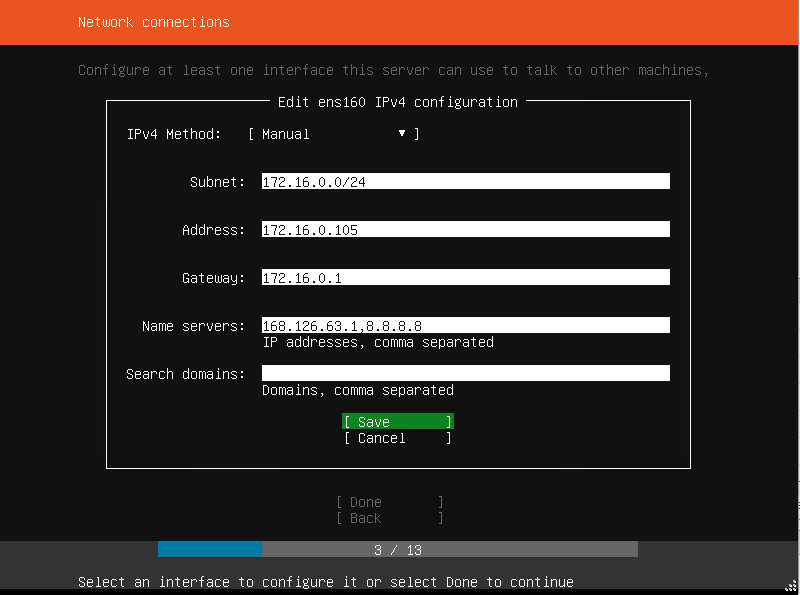

`version: 0.0.1`

# __Install Guide__

## 1. Install Ubuntu

Install ubuntu on EXSI `(hypervisor)`

- Fixed IP configure
  
  

  `Name Servers:  KT DNS (Anything fine ex. google.com)`

## 2. Install Docker

- Referer
  - Why Docker: <https://www.44bits.io/ko/post/why-should-i-use-docker-container>
  - Docker Introduction: <https://www.44bits.io/ko/post/easy-deploy-with-docker>
  - How Docker Image works: <https://www.44bits.io/ko/post/how-docker-image-work>

- Install docker(with internet connection)
  1. curl -fsSL https://download.docker.com/linux/ubuntu/gpg | sudo apt-key add -
  2. sudo add-apt-repository "deb [arch=amd64] https://download.docker.com/linux/ubuntu bionic stable"
  3. sudo apt update
  4. apt-cache policy docker-ce `(Check whether docker is installed or not)`
  5. sudo apt install docker-ce `(Install docker)`
  6. sudo systemctl status docker `(Check docker is well installed)`


- Install docker (without internet connection)

  - __Download docker__
  1. docker .tgz file download <https://download.docker.com/linux/static/stable/x86_64/>
  2. tar xzvf dsadadsa.tgz
  3. sudo cp docker/* /usr/bin/
  4. sudo dockerd & 
  </br><br/>
  - __Download docker-compose__
  1. file download <https://github.com/docker/compose/releases>
  2. mv docker-compose-Linux-x86_64 docker-compose
  3. sudo mv docker-compose /usr/local/bin/
  4. sudo chmod +x /usr/local/bin/docker-compose
  </br><br/>
  - __Execute docker__ 
  1. sudo setenforce Permissive
  2. `Any Dokcer Command`


- Docker Command
  - __Get Image:__ docker run`(pull)` ubuntu:18.04`(target)`
  - __Image check:__ docker images
  - __Container check:__ docker ps -a
  - __Remove container:__ docker rm 1dd07db11984`(Container ID)`
  - __Remove image:__ docker rmi 1dd07db11984`(Image ID)`
  - __Run image with particular name:__ docker run -i -t --name ubuntu`(name)` ubuntu:18.04`(tag)` /bin/bash
  - __Container restart step1:__ docker restart d3fef9c0f9e9`(Container ID)`
  - __Container restart step2:__ docker attach d3fef9c0f9e9`(Container ID)`
  - __Container change check:__ docker diff 65d60d3dd306`(Container ID)`  | head
  - __Commit container to image:__ docker commit 65d60d3dd306`(Container ID)` ubuntu:git`(Repository:Tag)`
  - __Add port to container:__ docker run -i -t --name mywebserver`(name)` -p 80`(host port)`:80`(container port)` ubuntu:14.04`(tag)`
  - __Run container at backgound:__ docker run -d --name detach_test wordpress
  - __Docker port check:__ docker port <컨테이너 이름, ID> <포트>
  - __Docker compose UP/DOWN:__ docker-compose up -d // docker-compose down -d
  - __Docker execute bash:__ docker exec -u root -it alpha_A_SK_1`(name)` /bin/bash
  - __Change container password:__ (1). docker exec -u root -it fa0f0eab29c3`(Container ID)` /bin/sh (2). passwd
  - __Save docker container with removed layer:__ docker export dd003ef816b4`(Container ID)` | docker import - soil-shipmentplanning-grpc:0.0.0.1`(Repository:Tag)`
  - __Save docker image to tar file:__ docker save -o soil-shipmentplanning-grpc-0.0.0.1.tar`(File Name)` c422801ce9f8`(Image ID)`
  - __Load docker image from tar file:__ docker load -i soil-shipmentplanning-grpc-0.0.0.1.tar`(File Name)
  - __Move file from container to host:__ docker cp dd003ef816b4`(Container ID)`:/grpc/shipment/sample.xlsx /home/pwc/

- Docker Compose
  - __docker-compose.yml__ example:
  ```yaml
  version: '3'

  services:
    rq-worker:
      restart: always
      image: docker-registry.alpha-cluster.net/production-pwc-alpha-rq-worker-s-oil:0.1.3
      command: /usr/bin/supervisord
      environment:
        - 'REDIS_CONNECTION_STR=redis://172.16.0.101:6379/'
        - 'REDIS_DB_NUM=1'
      ports:
        - "2001:22"
    A_SK:
      restart: always
      image: docker-registry.alpha-cluster.net/production-pwc-alpha-basic:0.0.1
      ports:
        - "2000:22"
      command: 
        - /usr/bin/supervisord
      volumes:
        - /home/alpha/temp/Report/:/A_SK/Report/
  ```


## 3. Install python3

1. apt-get update
2. apt-get install python3-pip python3-dev
3. pip3 -V `(version check)`
4. pip3 install --upgrade pip `(upgrade pip)`

- Install virtualenv
    1. apt install python3-venv
    2. apt install python3-virtualenv
    3. pip3 install virtualenv virtualenvwrapper
    4. virtualenv --python=파이썬버전 가상환경이름 ex(virtualenv --python=python3.6 가상환경이름)
    5. cd 가상폴더/bin/ `(change directory to virtualenv)`
    6. source activate `(activate virtualenv)`

    1.  `Additional -- Delete Lib`: sudo apt-get remove python-virtualenv 
    2.  `Additional -- Reinstall`: python3 -m pip install --upgrade --force-reinstall pip


## 4. Install Django (Inside virtualenv)

`가상환경 나가기: deactivate`

1. pip install django
2. django-admin startproject 프로젝트명
3. python manage.py runserver 0:8000

## 8. Install grpc

- Install proto3.5
  1. curl -OL https://github.com/google/protobuf/releases/download/v3.5.1/protoc-3.5.1-linux-x86_64.zip
  2. unzip protoc-3.5.1-linux-x86_64.zip -d protoc3
  3. sudo mv protoc3/bin/* /usr/local/bin/
  4. sudo mv protoc3/include/* /usr/local/include/
    ```
    Optional: change owner
    - sudo chown $USER /usr/local/bin/protoc
    - sudo chown -R $USER /usr/local/include/google
    ```
- Install grpc  
  1. python -m pip install grpcio
  2. python -m pip install grpcio-tools

- Install examples
  1. git clone -b v1.22.0 https://github.com/grpc/grpc
  2. cd grpc/examples/python/helloworld
  3. python greeter_server.py
  4. 

## 100. Install curl

1. sudo apt update
2. sudo apt install apt-transport-https ca-certificates curl software-properties-common

## 101. Install unzip

1. apt install unzip


## 102. Install openssh

1. __Install openssh:__ sudo apt-get install openssh-server
2. __Root Password change:__ passwd root
3. __Edit conf:__ vim /etc/ssh/sshd_config
    ```
    Port 22
    PermitRootLogin=yes
    ```
    `set user as root`
4. __Run ssh:__ service ssh start
5. `Additional -- Restart ssh`: service ssh restart `(status)`
   

## 103. Setting Locale

0. apt-get update
1. apt-get install locales
2. locale-gen ko_KR.UTF-8
3. export LC_ALL=ko_KR.UTF-8

- Checkin locale: locale, locale -a
- LocalHost Test: curl -X POST http://127.0.0.1:8001/api/translate/pptx

## 104. Install git

1. sudo apt-get install git `(update pacakge list)` or sudo apt install git
2. git --version
3. git config --global user.name [name] `(set my name when push)`
4. git config --global user.mail [mail-adress] `(set my email-address when push)`
5. git clone [url] `(download git file)`

## 105. Install supervisor
1. __Install:__ apt-get install supervisor
2. __Edit Config:__ /etc/supervisor supervisord.conf
  ```conf
  # /etc/supervisor/conf.d
  # python-schedule.conf 
  [program:python-schedule]
  command=python /www/alpha/scheduler/alpha_schedule.py
  autostart=true
  autorestart=true


  ;/etc/supervisor/conf.d

  [program:scheduler]
  command=python /test/Code/scheduler_test.py
  autostart=true
  ;autorestart=true
  ```
3. __Run supervisor:__ (1). service supervisor restart (2). supervisord -c supervisord.conf`(1번 안될시)`

## 106. Use stfp in linux
1.  __Login:__ sftp etl_share@222.98.18.81`(ID@IP)`
2. __Enter Password__
3. __Put File:__ put [File Name]
4. __Get File:__ get [File Name]

## 500. Error Message

1. __debconf: unable to initialize frontend: Dialog (1)__ 
    ```
    apt-get install dialog apt-utils
    ```
2. __debconf: unable to initialize frontend: Dialog (2)__
    ```
    sudo mkdir -p /var/lib/dpkg/{updates,alternatives,info,parts,triggers}
    sudo killall apt* software-center* dpkg
    sudo apt-get update
    sudo apt-get purge wine1.4 ia32-libs-multiarch
    sudo apt-get upgrade
    ``` 
3. 